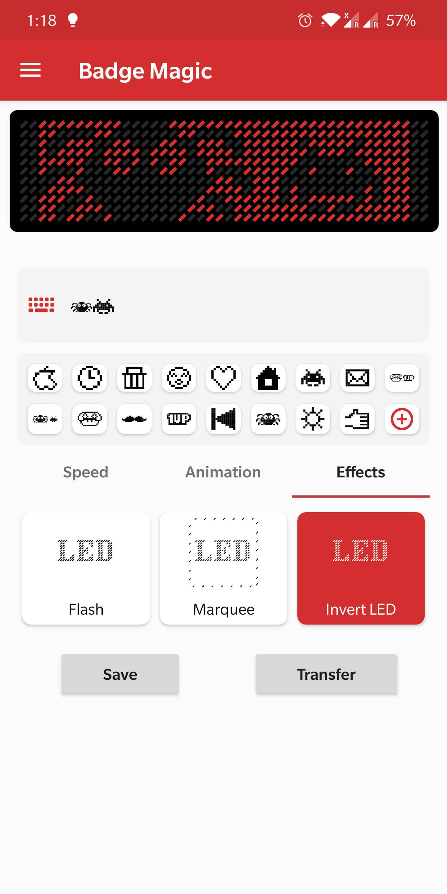
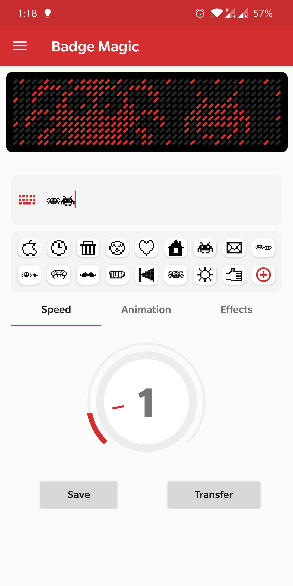
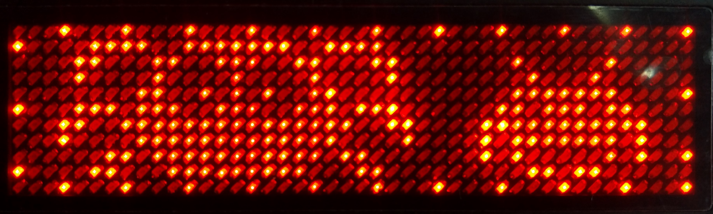
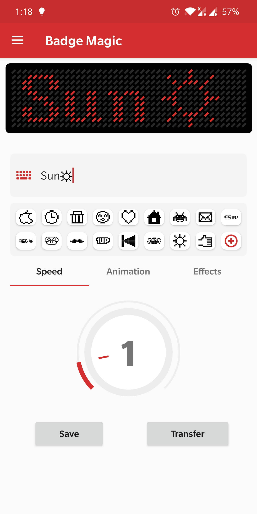

# Badge Magic
  

**Python Library to program via desktop https://github.com/fossasia/led-name-badge-ls32

**Magically Create Text and Draw Cliparts on LED Name Badges using Bluetooth**

The Badge Magic Android app lets you create moving text and draw clipart for LED name badges. The app provides options to portray names, cliparts, and simple animations on the badges. For the org.fossasia.badgemagic.data transfer from the smartphone to the LED badge it uses Bluetooth. The project is based on the work of [Nilhcem](https://github.com/Nilhcem).

## Download

* [Latest Release Build](https://github.com/fossasia/badge-magic-android/raw/apk/badge-magic-master-release.apk) in the apk branch
* [Latest Development Build](https://github.com/fossasia/badge-magic-android/raw/apk/badge-magic-development-release.apk) in the apk branch

## Permissions
* **Bluetooth**: For sending org.fossasia.badgemagic.data to the badge.
* **GPS Location**: This has been the standard set by Android for use with Bluetooth Low Energy (BLE) devices. For more information, please read the notes on [Android website](https://source.android.com/devices/bluetooth/ble).
* **Storage**: For storing and saving badges.

## Communication

Please talk to us on the badge-magic [Gitter channel here](https://gitter.im/fossasia/badge-magic).

## Available Devices

There are a number of devices with Bluetooth on the market. As far as we can tell they are mostly from the same manufacturer. When you get a org.fossasia.badgemagic.device ensure it comes with Bluetooth. There are devices that don't support Bluetooth. These are not supported in the app currently.
* Get one from the [FOSSASIA Shop here](https://fossasia.com/product/led-badge/)

## Screenshots

| <!-- -->    | <!-- -->    | <!-- -->    |
|-------------|-------------|-------------|
|   |   |   |
| <!-- -->    | <!-- -->    | <!-- -->    |
|   |   |   |

## Reverse-Engineering Bluetooth LE Devices

Security in Bluetooth LE devices is optional, and many cheap products you can find on the market are not secured at all. This applies to our Bluetooth LED Badge. While this could lead to some privacy issues, this can also be a source of fun, especially when you want to use an LED Badge in a different way. It also makes it easy for us to get started with the development of a Free and Open Source Android app. 

As we understand how the Bluetooth LED badge works, converting a text to multiple byte arrays, we can send using the Bluetooth LE APIs. An indepth blog post about reverse-engineering the Bluetooth community [is here](http://nilhcem.com/iot/reverse-engineering-bluetooth-led-name-badge). 

The implementation in the Android app consists of manipulating bits. That may be tricky. A single bit error and nothing will work, plus it will be hard to debug. For those reasons, and since the specs are perfectly clear the reverse engineer Gautier Mechling strongly recommends to start writing unit tests before the code implementation. 

## Branch Policy

We have the following branches

 * **development** All development goes on in this branch. If you're making a contribution, you are supposed to make a pull request to _development_. PRs to development branch must pass a build check on Travis CI.
 * **master** This contains shipped code. After significant features/bugfixes are accumulated on development, we make a version update and make a release.
 * **apk** This branch contains many apk files, that are automatically generated on the merged pull request a) debug apk b) release apk
    - There are multiple files in the apk branch of the project, this branch consists of all the APK files and other files that are relevant when an APK is generated.
    - Once a pull request is merged, the previous APK branch is deleted and a new APK branch is created.
    - If a PR is merged in development branch then the new APKs for the development branch are generated whereas the APKs corresponding to the master branch are not regenerated and simply the previously generated files are added.

## Contributions Best Practices

Please read FOSSASIA's [Best Practices](https://blog.fossasia.org/open-source-developer-guide-and-best-practices-at-fossasia/) before contributing. Please help us follow the best practice to make it easy for the reviewer as well as the contributor. We want to focus on the code quality more than on managing pull request ethics. Here are some basics:

* Single commit per pull request
* For writing commit messages please read the [CommitStyle.md](docs/commitStyle.md).
* Follow uniform design practices. The design language must be consistent throughout the app.
* The pull request will not get merged until and unless the commits are squashed. In case there are multiple commits on the PR, the commit author needs to squash them and not the maintainers cherrypicking and merging squashes.
* If the PR is related to any front end change, please attach relevant screenshots in the pull request description.
* Before you join development, please set up the project on your local machine, run it and go through the application completely. Press on any button you can find and see where it leads to. Explore.
* If you would like to work on an issue, drop in a comment at the issue. If it is already assigned to someone, but there is no sign of any work being done, please free to drop in a comment and start working on it.

## LICENSE

The application is licensed under the [Apache License 2.0](/LICENSE). Copyright is owned by FOSSASIA and its contributors.
